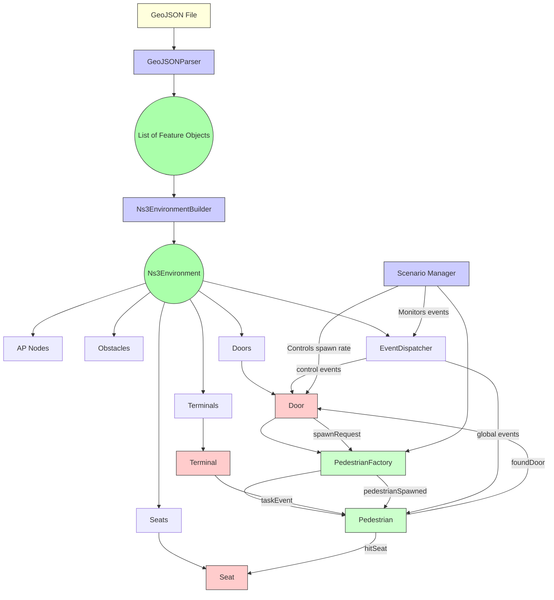

# MonadCountSim: Indoor GeoJSON-based NS-3 environment

**Work in progress**

The codebase sucks bigly. Will improve soon. Me wanna PhD.

## Install

```shell
git submodule add https://gitlab.com/nsnam/ns-3-dev.git extern/ns3-src
git submodule add https://github.com/nlohmann/json.git extern/nlohmann_json

cd extern/ns3-src && git checkout tags/ns-3.43
cd extern/nlohmann_json && git checkout tags/v3.11.3
```

## Toolchain Setup

### Using ExternalProject

```cmake
include(ExternalProject)

# =======================================================================
# Build ns-3 as an external project using its own build system (waf).
# =======================================================================
ExternalProject_Add(ns3
        SOURCE_DIR ${CMAKE_SOURCE_DIR}/extern/ns-3
        CONFIGURE_COMMAND ./ns3 configure --enable-examples --enable-tests --enable-mpi
        BUILD_COMMAND ./ns3 build
        INSTALL_COMMAND ""
        # Build in source because ns-3 uses its own directory structure.
        BUILD_IN_SOURCE 1
)
```


```shell
# Sync submodules
git submodule update --init --recursive      

# Configure and build NS3 
cd extern/ns3-src
# Ugly, need to take notes. Me lazy fuck
./ns3 configure --enable-examples --enable-tests --enable-mpi --prefix /Users/jdubec/Projects/MonadCount/monadcount-sim/extern/ns3-dist
./ns3 build
./ns3 install

# Execute cmake: TBD
```

