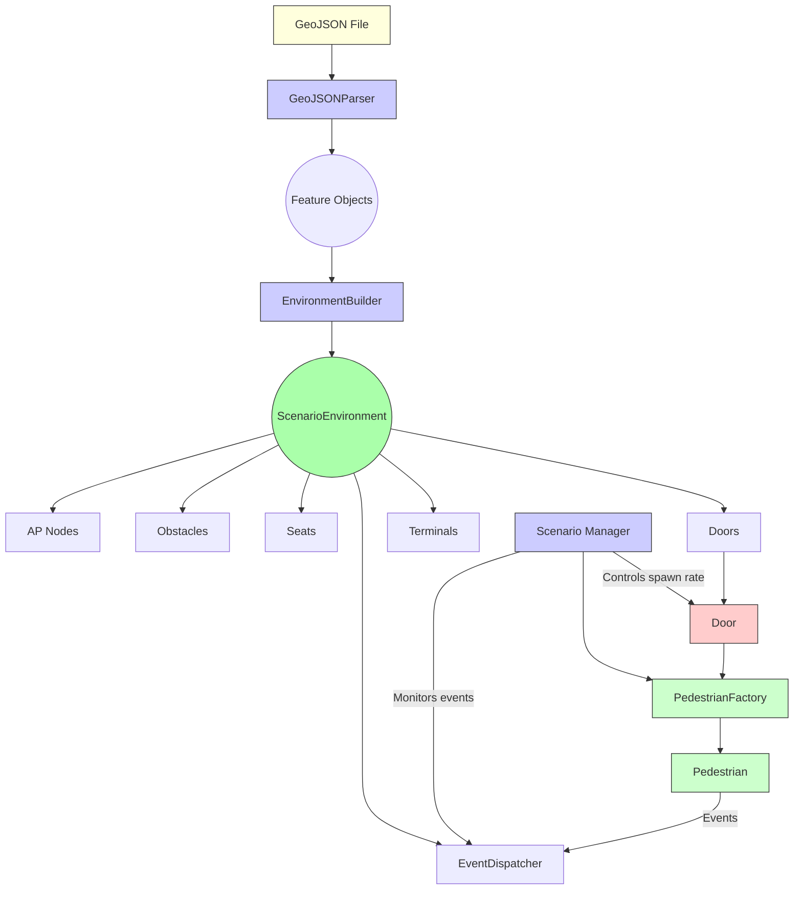

# MonadCountSim: Indoor GeoJSON-based NS-3 environment

**Work in Progress - PhD Sanity Optional**

A simulation framework for indoor environments using GeoJSON and NS-3. Uses fancy algorithms to model pedestrian 
movement, Wi-Fi signal propagation, and general chaos.

## Architecture



## Install

**Pre-requisites:**

- C++20 compatible compiler
- CMake 3.14+
- Git

### Step 1: Clone the Repository with Submodules


```shell
git clone https://github.com/Sibyx/monadcount-sim.git
cd monadcount-sim
git submodule update --init --recursive
```

### Step 2: Build dependencies

```shell
make all
```

This will:

- Build NS-3 from the submodule
- Install NS-3 to the local `extern/ns3-dist` directory
- Configure and build the MonadCountSim project

**Alternative: Step-by-Step Build**

```shell
# Build NS-3
make ns3

# Build netanim

# Build MonadCountSim
make build
```

## Running the Simulation

```shell
# Run the default scenario
bin/monadcount-sim

# Run with a specific scenario and GeoJSON input
bin/monadcount-sim --scenario=basic --input=geojson/room.geo.json

# output of simulation is in data/* 

# Open simulation using netanim
bin/netanim data/basic/netanim.xml
```

## LEGACY: Project & Toolchain Setup

This part of readme is for now just a note for me, to not forget how to set up the project and toolchain.

Use just for troubleshooting, not for normal development.

### Project creation from scratch

```shell
git submodule add https://gitlab.com/nsnam/ns-3-dev.git extern/ns3-src
git submodule add https://github.com/nlohmann/json.git extern/nlohmann_json
git submodule add https://gitlab.com/nsnam/netanim.git extern/netanim
git submodule add https://github.com/usnistgov/NetSimulyzer-ns3-module extern/netsimulyzer-ns3
git submodule add https://github.com/usnistgov/NetSimulyzer extern/netsimulyzer-gui

git submodule update --init --recursive

cd extern/ns3-src && git checkout tags/ns-3.43
cd extern/nlohmann_json && git checkout tags/v3.11.3
```

### Manual NS-3 build

```shell
# Sync submodules
git submodule update --init --recursive      

# Configure and build NS3 
cd extern/ns3-src
# Ugly, need to take notes. Me lazy fuck
./ns3 configure --enable-examples --enable-tests --enable-mpi --prefix /Users/jdubec/Projects/MonadCount/monadcount-sim/extern/ns3-dist
./ns3 build
./ns3 install

# Execute cmake: TBD
```
