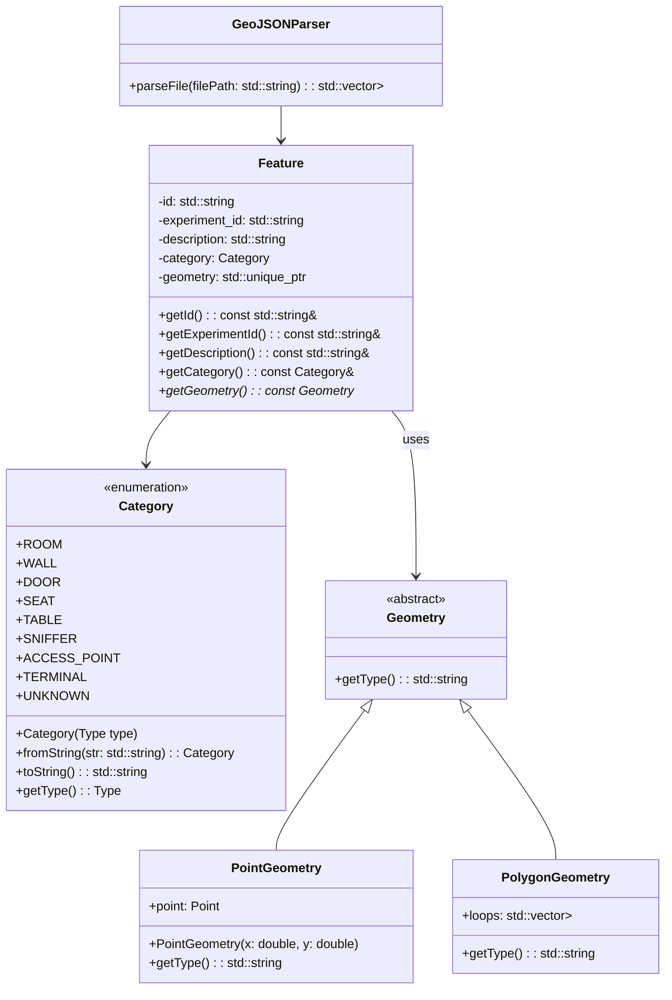

```mermaid
classDiagram
    class Category {
        <<enumeration>>
        +ROOM
        +WALL
        +DOOR
        +SEAT
        +TABLE
        +SNIFFER
        +ACCESS_POINT
        +TERMINAL
        +UNKNOWN
        +Category(Type type)
        +fromString(str: std::string) : Category
        +toString() : std::string
        +getType() : Type
    }

    class Geometry {
        <<abstract>>
        +getType() : std::string
    }
    class PointGeometry {
        +point: Point
        +PointGeometry(x: double, y: double)
        +getType() : std::string
    }
    class PolygonGeometry {
        +loops: std::vector<std::vector<Point>>
        +getType() : std::string
    }
    class Feature {
        -id: std::string
        -experiment_id: std::string
        -description: std::string
        -category: Category
        -geometry: std::unique_ptr<Geometry>
        +getId() : const std::string&
        +getExperimentId() : const std::string&
        +getDescription() : const std::string&
        +getCategory() : const Category&
        +getGeometry() : const Geometry*
    }
    class GeoJSONParser {
        +parseFile(filePath: std::string) : std::vector<std::unique_ptr<Feature>>
    }

    Geometry <|-- PointGeometry
    Geometry <|-- PolygonGeometry
    Feature --> Category
    Feature --> Geometry : uses
    GeoJSONParser --> Feature
```